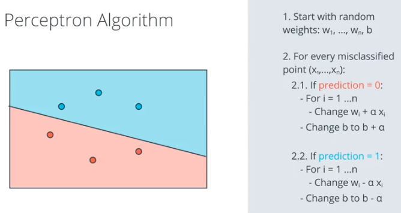
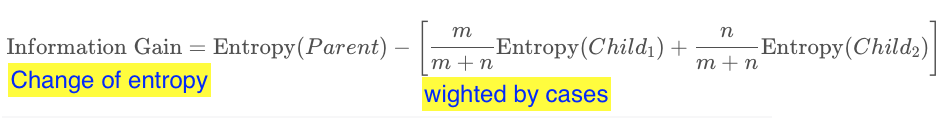
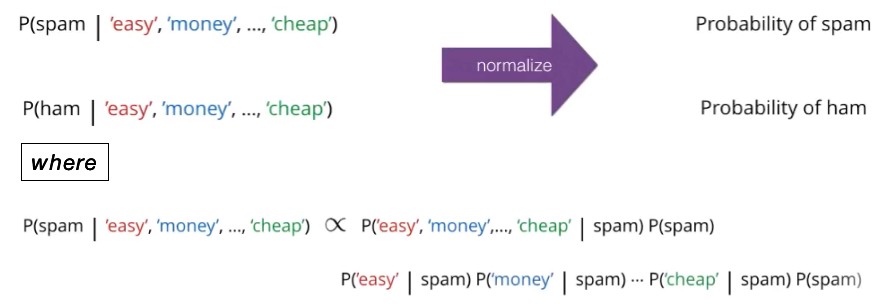

# Udacity Data Scientist Nano Degree

[TOC]

## Part 1: Supervised Learning

### Lesson 1: Machine Learning Bird's Eye View

#### History of Machine Learning

- statisticia's perspective
  - understand real world data by create some distribution to simulate actual data
- computer scientist's perspective
  - computer should recoginizing patterns of real world data
  - more flexible model, better accuracy, but less explainable

#### Types of Machine Learning

- Supervised: classification / regression
- Unsupervised
- Reinforcement

#### Deep Learning

- More accurate
- Barriers: data / calculation resource / why making a decision

### Lesson 2: Linear Regression

#### Fitting Line to Data Points

> Tricks and error functions are linked by gradient descent

##### Absolute Error

1. consider only delta on x axis --> so different rules for point over or underneath the line
2. may not has single minimum point for gradient descent


##### Mean Squared Error

1. consider both delta on x axia and y axis --> single rule for both cases
2. error function is quadratic so has single minimum point


#### Closed Form Solution for Minimizing Error Function

> Closed form solution using linear algebra, which is low efficiency while handling n dimensional matrix. And gradient descent is faster in this case giving a acceptable result for our model.

[Solution on Udacity](https://classroom.udacity.com/nanodegrees/nd025/parts/c6a7e66b-64f6-41eb-9b3e-e068e0ed962b/modules/aea22017-a8fe-4902-ba79-0d79f161a6bb/lessons/859b60ff-7303-45ce-a4cb-2dce0c0e6272/concepts/fcb495b1-c94e-4a37-b9f8-247584fa735f)


#### Drawbacks of Linear Regressiong

1. Data should be linear, otherwise, transfrom features or add polymonial features (e.g. PolynomialFeatures in sklearn)
2. Sensitive to outliers

#### Regularization


#### Feature Scaling

> When we need scaling?
>
> 1. When your algorithm uses a distance based metric to predict. 
> 2. When you incorporate regularization.
> 3. Speed up your algorithm

**Standardizing:** interpreted as the number of std from mean

```python
df["height_standard"] = (df["height"] - df["height"].mean()) / df["height"].std()
```

**Normalizing:** 0~1

```python
df["height_normal"] = (df["height"] - df["height"].min()) /     \
                      (df["height"].max() - df['height'].min())
```

### Lesson 3: Perceptron Algorithm

#### Representationg of Perceptron


#### Algorithm



### Lesson 4: Decision Tree

#### Entropy

**Three ways of understanding:**

- Physics: how much freedom does particle to move around?
  - The more the higher entropy
- Combinatorics: how many ways of arranging four balls in a line (4 red / 3 red + 1 blue / 2 red + 2 blue)?
  - The more the higher entropy
- Knowledge: how much do we know about the color of ball, when picking up one ball from each bucket (as above senario)?
  - The less the higher entropy

#### Entropy Formula

> **Game rule:** pick balls with put back for 4 times from below buckets, and the outcome is the same sequence as below


#### Information Gain



### Lesson 5: Naive Bayes

#### Bayes Theorem


#### Application 1: False Positive on Patient


#### Application 2: Spam or Ham


#### Naive Bayes Algorithm

**Assumption:** $P(A\cap B) = P(A)P(B)$, which means case A and case B are independent

- If there are dependent, like temperature is low for A and high for B, this equation not hold

**Simplified Conditional Probability:** $P(A|B)\propto P(B|A)P(A)$,  since $P(B)$ will be cancelled out



