# Udacity Data Scientist Nano Degree

[TOC]

## Part 2: Deep Learning

### Introduction to NN

#### Error Function

> Error function describes the distance from current to the target -- optimized point
>
> And the direction and step towards the target is determined by gradient descent

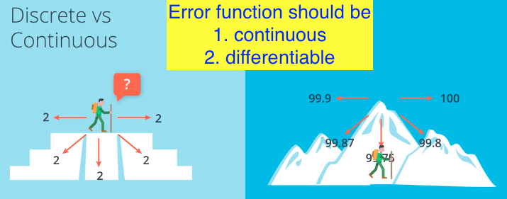

#### Activation Function

> Transform discrete output to continuous output, so that easier for optimization

**Sigmoid**

> Use sigmoid instead of step activation function, transforming yes/no to probability

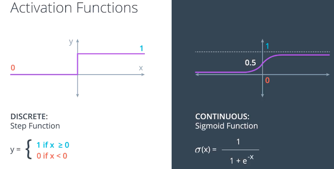

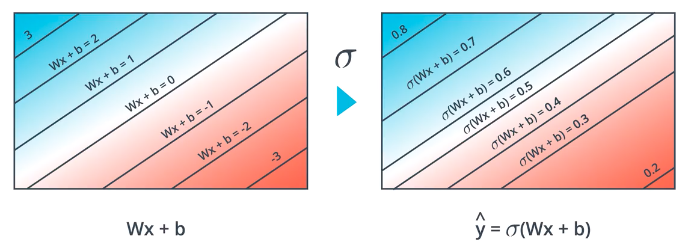

**Softmax**

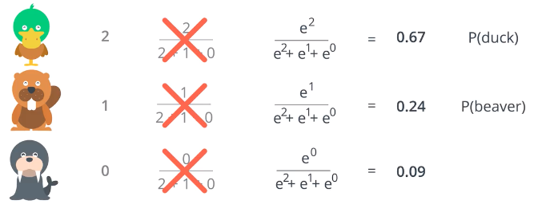

#### Maximum Likelihood of Model

> The higher likelihood, the better model

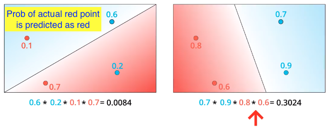

#### Cross Entropy of Model

> Connection between minimizing error function and maximizing likelihood

**1. We prefer sum to product --> use log**

**2. We prefer positive to negative --> minus**

**3. Therefore**

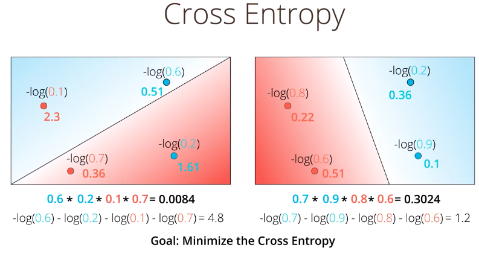

**Multi-Class Cross-Entropy**

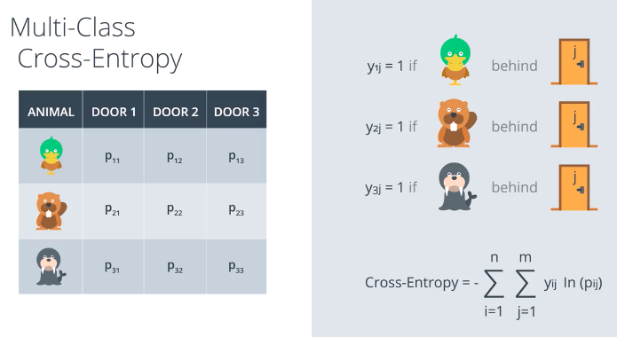

#### Logistic Regression

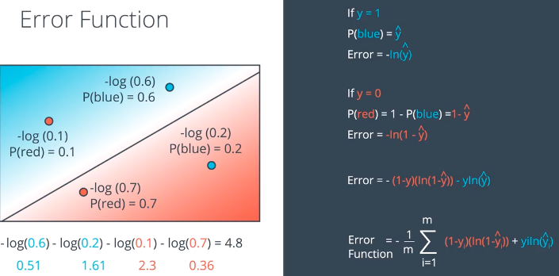

####Gradient Descent

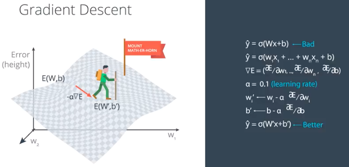

##### Perceptron vs Gradient Descent of Logistic Regression

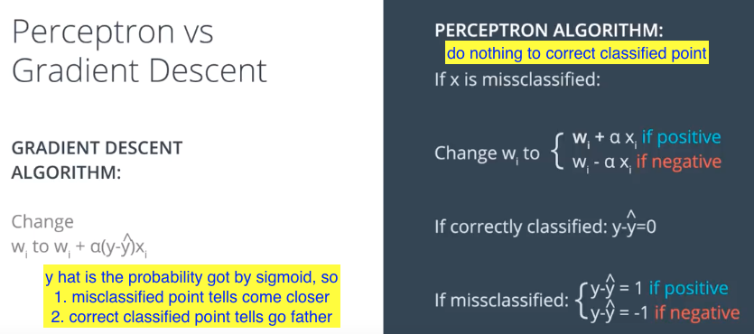

#### Neural Network Architecture

> Combining multiple linear models **(probability graphs)** into one non-linear model

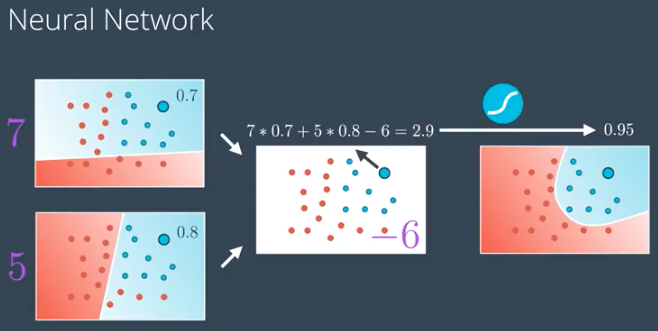